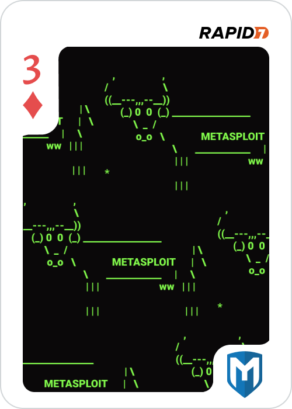

# 3 of Diamonds - port 8880

Here we had another web service claiming "secure file storage" and a quote:

	"Our service is 100% unhackable" -- Our CEO

From looking around we find a page `retrieve.html` where a key needs to be entered. Inspective the form showed that it was sending data to `load.php` as `172.16.4.85:8880/load.php?KEY=`.Submitting some test data in the form would give us the message "Unknown key".

When thinking about the topic of this challenge, we want to extract data and one popular way to do that is via SQL injection. To confirm if this is the case, we try to get the typical error with `/load.php?KEY='` but there was no error. Eventually we find that `/load.php?KEY="` would give us the SQL error we expect.

Now running sqlmap we can dump the database and get the image out which was in base64 format.

`sqlmap -u 172.16.4.85:8880/load.php?KEY= --dump`

Also interesting to note is that there is also an entry here for the Ace of Hearts. Downloading this file shows that it's a PGP keyring file, so we'll save this for later.

