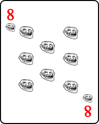
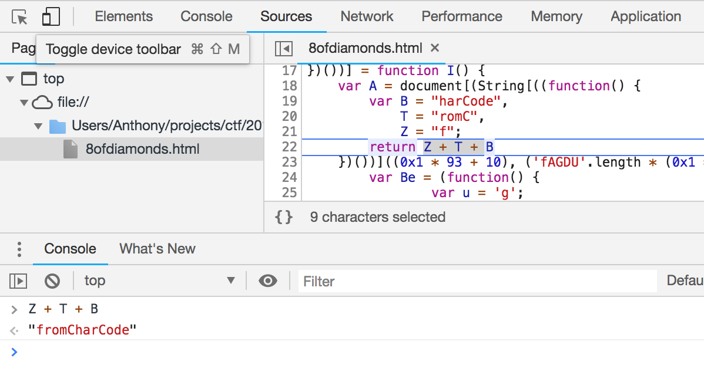
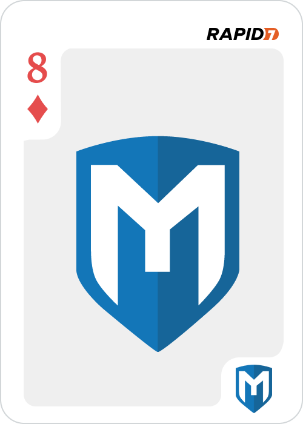

# 8 of Diamonds - port 8181

First check what's there `curl 172.16.4.85:8181`

We get a huge chunk of HTML code - see `challenge.html` for the original code. Opening it in the browser shows:



Of course this is a troll and we need to find the real image. First thing is to deobfuscate the javascript used for easier debugging. You can use a website like https://beautifier.io/ or Chrome can do this automatically for you with the `{}` button you see in the image.



The basic idea is to use the browser debugger, step through and watch variables as they get assigned. At some point, the javascript inserts the base64 image from an array `H[0]` and this array has two elements in it. When stepping through the debugger you'll see that code within `H[<code>]` evaluates to `0`.

```
})() + H[(String.fromCharCode(0121, 0127)[(String.fromCharCode(0x6c, 0x65, 0156, 0x67, 116, 0x68))] - 'tZ'.length)]);
```

`H[1]` is the element with the real flag so change the code to get it.

