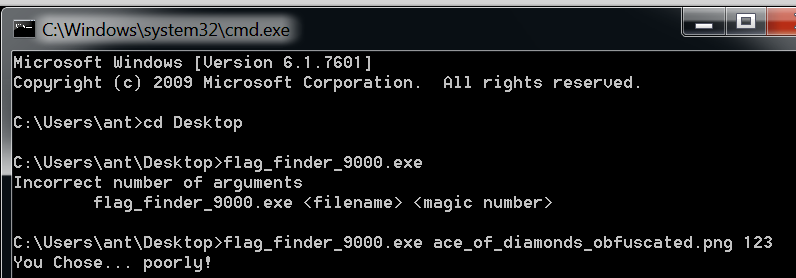
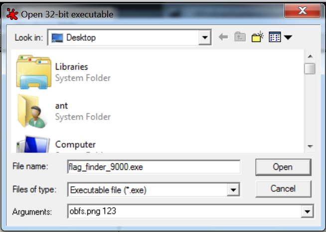
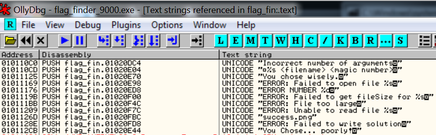
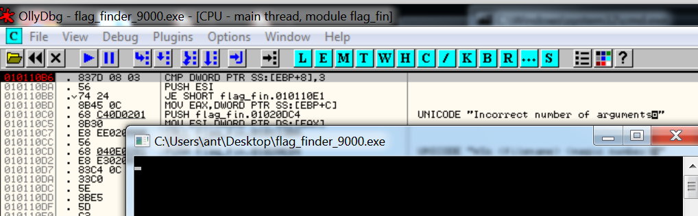
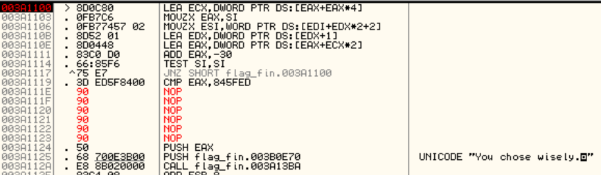
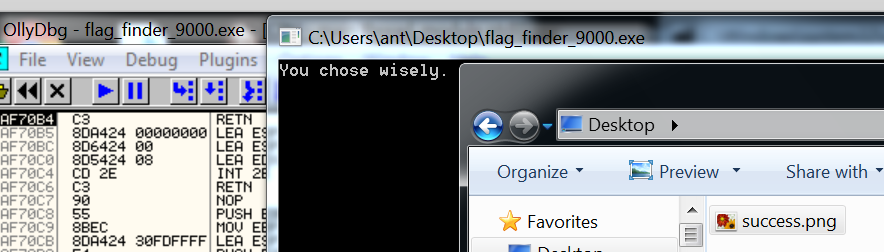

# Ace of Diamonds

An obfuscated image is easily found, and also an exe. We have to use the exe to deobfuscate the image.

Running the exe we see that it wants a file and a magic number.

I decided to try Ollydbg to see what's happening. When you open the file in Ollydgb, be sure to set some arguments.

Once loaded, I wanted to see what strings are loaded. So right click on the code, select Search for -> All referenced text strings.

Double clicking on the first entry jumps us to the point in the code where it lives. From here it's easier to guess where to place debug points.

I placed some breakpoints then I could start stepping into the code.

After a while of stepping in it reaches a loop where a comparison is made with `JNZ 00F912CA`. I assumed at this point it was checking if the magic string was correct or not, since after this loop it directs me to the failure message.

A simple way I found to bypass this is to remove the jump completely by replacing it with NOPs. Right click on the line of code, select Binary -> Fill with NOPs

Continue execution and it will show a success message! We can now find the flag deobfuscated as `success.png`.

