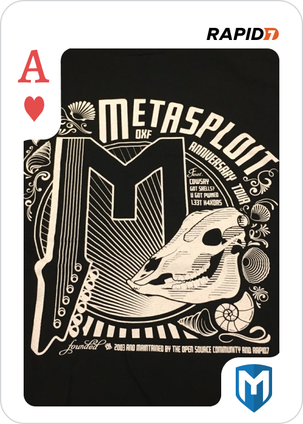

# Ace of Hearts

This was a two part challenge. See 3 of Diamonds for how to get the gpg key from the Ubuntu box.

The encrypted png is easily found on the Windows box, so now we simply have to decrypt it.

```
root@kali:~# gpg --import ace_of_hearts.gpg
gpg: key 6FB558C7F65EEAD9: public key "root@metasploit.com <root@metasploit.com>" imported
gpg: key 6FB558C7F65EEAD9: secret key imported
gpg: Total number processed: 1
gpg:               imported: 1
gpg:       secret keys read: 1
gpg:   secret keys imported: 1
root@kali:~# gpg --decrypt ace_of_hearts.png.gpg > ace_of_hearts.png
gpg: encrypted with 1024-bit RSA key, ID 604B2809D3525160, created 2018-11-08
      "root@metasploit.com <root@metasploit.com>"
```

